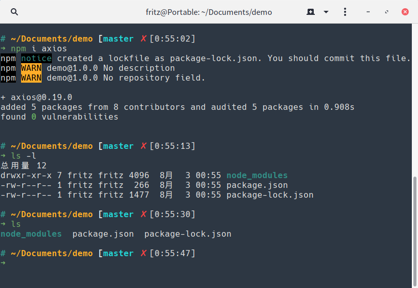

# fritz-zsh-theme
A custom theme for oh-my-zsh



## To get & set the theme
```bash
git clone https://github.com/fritzccc/fritz-zsh-theme.git
cd fritz-zsh-theme
cp fritz.zsh-theme ~/.oh-my-zsh/themes/
```
```bash
# then change the theme settings in .zshrc
nano ~/.zshrc
```
Done!
